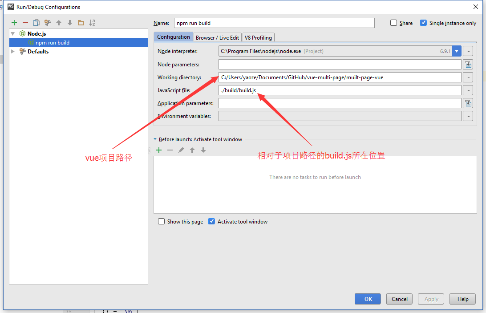
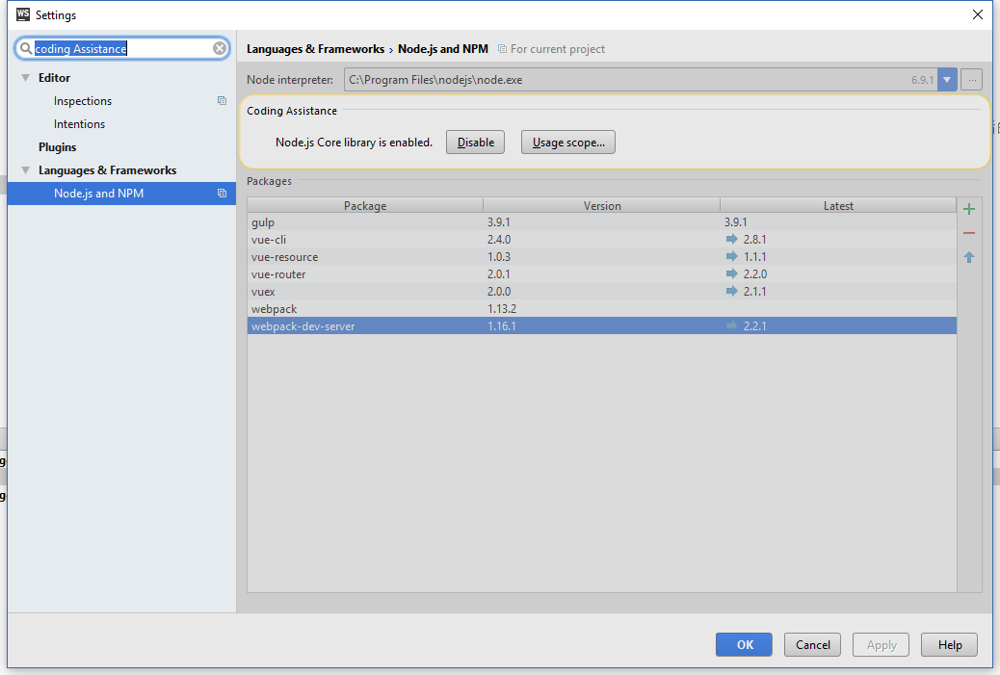

#交接文档

项目Baza.Ats是雇得易主要的工程。目录css,css2,script,script2,static都是前端的一些资源。样式也是有几分，不同时期的全局、风格样式,引用比较混乱，基本以覆盖为主。
业务以jquery为主，没有人做模块化，引用比较混乱。也是写了几份通用的common.js,要注意不同的地方改之前最好看下是否会影响到其他页面引用。
视图文件有view是之前后端的webform。后面改的mvc大部分迁移到view2里面去了。找页面先到views里面看。
跟路径Combres.xml是后端打包样式,js的配置的地方。里面可以体现引用关系.

#雇得易职位、招聘流程改版说明

##   改版初衷

雇得易项目经过几批人的开发改版历史周期比较长，不同风格的前端代码样式沉淀混淆在一起，为了解决这已难题，公司决定今年年初改版优化雇得易的用户体验，顺便重做之前的前端框架梳理逻辑。

##   技术选型

1. 因为之前前端loader选用的框架是Vue，所以这次雇得易改版为了统一全公司技术栈，没有考虑别的框架，然后因为雇得易是Sass系统，与饿了么那套elementUI比较切合，选用elementUI作为UI和基础组件。
2. 工程化选用主流webpack，本来考虑做成单页SPA，项目loader结合公司实际用人成本否决了。直接使用vue-cli修改比较麻烦且结合项目需求定制化考虑自己做了一套构建配置。
3. 考虑到雇得易项目久远功能逻辑较为复杂，决定引用Vuex作为状态管理。

##  实现思路

1.  多页应用依赖后端视图，需要在每个页面加上此页面的打包js，然后渲染一个空的后端cshtml视图文件。
2.  打包逻辑是遍历src/pages目录下的所有二级目录，每个目录是具体页面单独使用的js，打包到Vue项目根路径Vue/dist
3.  打包分为框架使用vue、vuex、fetch、promise等全局使用且不会经常变动的资源用webpack dll插件打包单独文件，减少开发编译时间
4.  经常共用的组件、工具使用webpack common插件打包一个单独文件,综上，每个空的后端视图有三个基本文件（vendor.dll.js，common.js,页面page.js）
5.  样式extract-text-webpack-plugin插件输出/dist/css，图片大部分是使用的阿里iconfont，静态图片cdn。

##  具体过程

0.  默认系统环境及配置软件
    1.  Windows 10

    2.  VSCode

    3.  WebStorm

1.  初始化Git目录

    1.  略过，公司大神多
    
2.  安装配置基础工具

    1.  nodejs
    2.  npm
        1.  npm配置
            1.  由于GFW的原因, 用npm默认源是基本没法下载代码包的，所以需要切换成淘宝的源
                1.  执行命令  
                    ` npm config set registry="http://registry.npm.taobao.org" `

    3.  安装依赖
        1.  切换到待初始化vue项目的目录下, 执行命令 `npm install`
        2.  安装其他依赖(例如[element-ui](http://element.eleme.io/#/zh-CN)组件etc，这里随便安装就可以了)
        
    4.  elementUI自定义样式

       element-variables.css是ElementUI的样式配置文件，需要自己打包修改
       
       `et -o ./src/theme/ -m`

    5.  执行到这一步之后，一个基础的vue单页面项目就已经建好了，如果直接运行`npm run dev`的话，就可以直接进行开发工作。但是因为我们要做的是多页面项目，所以下边就要开始各种魔改了

    6.  WebStorm配置

        在修改代码之前要先处理下WebStorm的配置问题，否则代码改起来会比较别扭
        1.  将js模式改为ES6模式，否则的话各种报错，没有import方法etc

            
        2.  关闭分号缺失提示

            vue-cli生成的模版里是不带分号的，所以需要在WebStorm里关掉分号缺失自动报错功能

            方法为：Setting中搜索unterminated ，去掉打钩

            

        3.  关闭safe-write功能

            这个选项会让WebStorm保存之后不直接写到原文件里，导致webpack dev模式监听不到文件变化，从而也就不会重新编译代码，只有重新运行`npm run dev`才能加载新代码，非常麻烦
            所以一定要关掉它

            方法：Setting中搜索 `safe write`, 在System Setting里

            

        4.  添加debug功能

            我们在测试webpack功能的时候(例如写插件)需要单步执行命令，这时候就需要进行一下配置

            1.
                

            2.
                

        5.  【可选】打开node.js的库函数提示

            WebStorm支持对node.js自带的库函数进行提示,在设置中搜索`coding assistance`点击`enable`即可

            

    7.  目录结构

        1.  删除无用的文件,添加.gitignore配置
            1.  在.gitignore中添加`dist/`,`.idea/`配置，忽略打包和webstorm配置文件
            
        2.  目录说明
                |-- mock-server     mock数据
                |-- src 源码
                    |----action     vuex异步操作，提交mutation
                    |----api        fetch的操作都写在这里
                    |----components 雇得易业务组件   
                    |----constants  全局使用的变量枚举类
                    |----layouts    存放共用资源，现在只有全局的基本样式 
                    |----mutations  vuex更新状态
                    |----pages      页面视图逻辑vue源码，每个目录一个页面,每个页面三个文件（vue文件，scss,构造js）
                    |----store      vuex配置文件
                    |----theme      elementUI自定义样式
                    |----utils      工具js, 存放通用的工具代码
                |----build.js       线上自动化编译js            
                |----gulpfile.js    线上gulp打包编译，之前没有配线上webpack，也不会配。用之前的gulp
                |----proxy.js       代理后端服务转发请求（因为前端现在是自己的web服务才能访问编译的js,需要代理请求后端接口和页面）
                |----webpack.base.conf.js webpack基础配置
                |----webpack.dll.conf.js  webpackDll插件配置
                |----webpack.dev.conf.js  webpack开发环境配置
                |----webpack.prod.conf.js webpack线上环境配置
                
    8. 执行项目

        到这一步就可以编译具体项目了
        1.  本地测试
            1.  执行命令`npm start`
            2.  启动vs雇得易项目
            3.  访问http://localhost:3000/（会代理访问启动的后端项目http://localhost:1983/）

        2.  线上编译
            `npm run build`
            
    9. 测试线上编译
       
       1.代码合并后,bamboo会pull一份最新的代码到12那台机器。
       
       2.12会根据配置的项目一步一步编译前后端代码。
       
       3.前端的编译是运行的gulp命令，根据环境变量env=production运行webpack.prod.config.js编译压缩代码，期间gulp还会给文件加版本号，然后复制到vs项目的/obj/Deploy/（这是他们iis跑的目录）目录.
       
##  遗留问题

1. 开发时间、成本的问题，组件没有只是分为基础的elementUI和具体的业务组件，没有细分逻辑重用度不高。

2. 能力问题，mutations状态更新没有用到精髓，结构、设计模式都有小问题，业务也过于集中不够直观。

3. 性能问题，vue的核心思路，element组件的的源码都需要很了解，某些业务绑定的数据过多，api请求成本都需要优化。前后端也没用完全分离。
